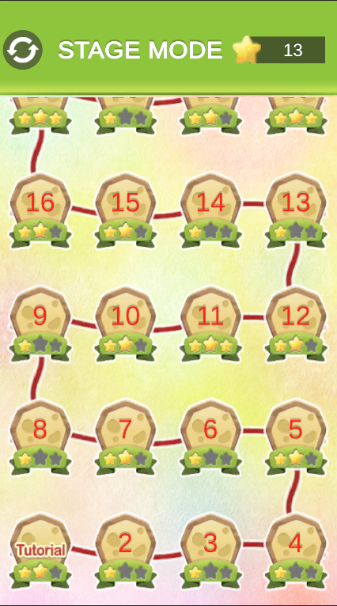
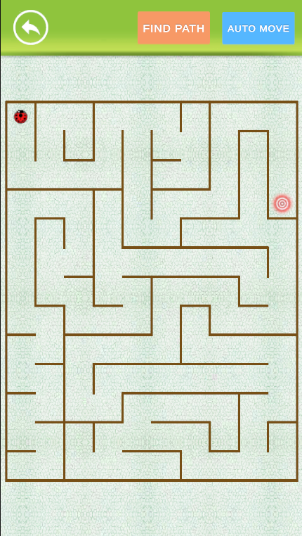
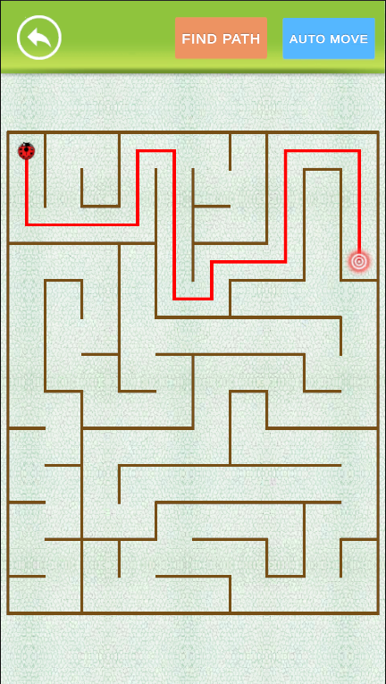

# Pathfinder Bug Game

A Unity game project focused on dynamic maze generation, pathfinding, and a robust UI system with object pooling and custom visual effects.

## Table of Contents

- [About The Project](#about-the-project)
- [Key Features](#key-features)
- [Project Structure](#project-structure)
- [Technical Highlights](#technical-highlights)
  - [Dynamic Maze Generation](#dynamic-maze-generation)
  - [Pathfinding System](#pathfinding-system)
  - [UI System & Virtualized Scrolling](#ui-system--virtualized-scrolling)
  - [Centralized Object Pooling](#centralized-object-pooling)
  - [Background Reveal Shader](#background-reveal-shader)
  - [DOTween Integration](#dotween-integration)
  - [Testability & Dependency Injection](#testability--dependency-injection)
- [Getting Started](#getting-started)

---

## About The Project

This project is a Unity-based game showcasing various gameplay mechanics and architectural patterns, including procedural content generation (mazes), efficient UI rendering, and a custom pathfinding solution. Players navigate a bug through a dynamically generated maze to reach a target, with a stage selection screen and various visual flourishes.
### Screenshots & Gifs

Here are some visual examples of the game's features.

**Main Menu:**



_The initial screen where players can start their adventure._

**Gameplay View:**



_Navigating the dynamically generated maze._



_Players can request a visual hint, displaying the shortest path from the bug's current position to the target gate, calculated using the game's BFS pathfinding system._

---

## Key Features

*   **Dynamic Maze Generation:** Procedural generation of mazes ensuring full connectivity.
*   **Shortest Pathfinding:** Implemented Breadth-First Search (BFS) to find optimal paths for the bug.
*   **Bug Movement:** Automated movement of the bug along the calculated path.
*   **Scrollable Stage Selection UI:** A performant UI for stage selection using object pooling and virtualization (only visible elements are active).
*   **Dynamic UI Scaling:** `CanvasScaler` logic to ensure UI adapts correctly to various screen aspect ratios.
*   **Interactive Background Reveal:** A custom shader that reveals the background image with a circular, rotating effect, centered dynamically on a game object.
*   **Centralized Object Pooling System:** A custom, reusable object pooling solution to minimize `Instantiate` and `Destroy` calls, improving performance.
*   **Memory-Safe UI Animations:** DOTween integration for UI animations with automatic `Tween` linking to `GameObject` lifecycle.
*   **Robust Data Management:** Handling of stage data (locked/unlocked, stars obtained).
*   **Modular Architecture:** Use of Singletons for managers and interfaces for dependencies to improve testability and maintainability.

---

## Project Structure

The core game logic and assets are primarily located under `Assets/=====Main=====`.

*   **`Assets/=====Main=====/Scripts`**: Contains most of the game's C# scripts.
    *   `GamePlay/`: Logic for the bug, gate, and core gameplay elements.
    *   `Manager/`: Core game managers (GameManager, GUIManager, DataManager, ObjectPooler, MenuManager, GamePlayManager).
    *   `Maze/`: Maze generation algorithms, cell data, and pathfinding logic (MazeGenerator, Cell, MazePathfinder).
    *   `UI/`: UI canvas controllers, popup logic, and UI effects.
        *   `Canvas/`: Specific canvas implementations (MenuCanvas, GamePlayCanvas, BackGroundCanvas).
        *   `Popups/`: Popup logic (StagePopup, StageUIElement).
        *   `UiEffect/`: Custom UI animation and particle effect handlers.
    *   `Data/`: ScriptableObjects and serializable classes for game data (StageListAsset, StageData, StageDynamicData).
    *   `Interface/`: Custom interfaces for modularity and testability (e.g., `IMazeGenerator`, `IMazePathfinder`, `IObjectPooler`).
    *   `Utilities/`: Extension methods and utility scripts (e.g., `ComponentExtensions.cs` for `GetOrAddComponent`, `IPoolable.cs`, `PooledObjectInfo.cs`).
*   **`Assets/=====Main=====/Shader`**: Custom shaders, including the background reveal effect (`BackGroundShader.shader`).
*   **`Assets/Clouds/Scripts/UI/`**: Additional UI-related scripts and utilities, including `DOTweenAnimationFactory.cs`.

---

## Technical Highlights

### Dynamic Maze Generation

The `MazeGenerator.cs` script is responsible for creating a fully connected maze.

*   **Algorithm:** Uses a modified Recursive Backtracker (Depth-First Search - DFS) algorithm.
*   **Guaranteed Path:** A primary path from a defined start to a random end cell is generated first to ensure reachability.
*   **Full Connectivity:** The generation process includes logic to actively connect potentially isolated regions of the maze to ensure a single connected component, preventing unreachable areas.
*   **`Cell.WorldPosition`:** Each `Cell` stores its `WorldPosition` directly, simplifying coordinate transformations for instantiation and path visualization.

### Pathfinding System

The project incorporates a dedicated pathfinding solution for the bug.

*   **`IMazePathfinder` & `MazePathfinder.cs`:** A modular system that implements Breadth-First Search (BFS) to find the shortest path between any two `Cell` objects in the generated maze.
*   **Integration:** `GamePlayManager.cs` utilizes `IMazePathfinder` to calculate paths from the bug's current position to the target (Gate), then passes this path to the `Bug` for movement.

### UI System & Virtualized Scrolling

The stage selection screen (`StagePopup.cs`) is designed for performance and flexibility.

*   **Virtualized Scrolling:** Only UI elements currently visible within the `ScrollRect`'s viewport are active, significantly reducing draw calls and memory usage for large lists of stages.
*   **Snake Pattern Layout:** Stage UI elements are laid out in a "snake" pattern for visual appeal.
*   **Dynamic Layout Metrics:** Layout parameters (cell size, spacing, padding) are derived from a `GridLayoutGroup` in the Editor but handled manually at runtime after disabling the `GridLayoutGroup` component for full control.
*   **`BaseCanvas.cs`:** Includes logic to dynamically adjust `CanvasScaler.matchWidthOrHeight` based on screen aspect ratio to maintain consistent UI scaling.

### Centralized Object Pooling

A custom object pooling system (`ObjectPooler.cs`) is implemented to manage the lifecycle of frequently instantiated objects.

*   **`ObjectPooler.cs`:** A singleton (can be made scene-specific by removing `DontDestroyOnLoad`) that manages pools (queues of `GameObject`s) for different prefabs.
*   **`IPoolable.cs`:** An interface for objects that can be pooled, providing `OnGetFromPool()` and `OnReturnToPool()` callbacks for state management.
*   **`PooledObjectInfo.cs`:** A helper component attached to pooled objects to track their original prefab, enabling generic return to pool.
*   **Integration:** `StagePopup.cs` now uses `ObjectPooler.Instance` (or injected `IObjectPooler`) to retrieve and return `StageUIElement`s and line prefabs, drastically reducing GC allocations.

### Background Reveal Shader

A custom shader (`BackGroundShader.shader`) creates a unique visual effect.

*   **Circular Reveal:** An image is revealed through a growing circle effect.
*   **Aspect Ratio Correction:** The shader dynamically adjusts its calculations based on the screen's aspect ratio to ensure the reveal circle always appears perfectly round, even if the UI element holding it is non-uniformly scaled.
*   **UV Rotation:** The revealed texture itself rotates around the reveal center as the reveal progress increases.
*   **Dynamic Centering:** `GamePlayManager.cs` calculates the UV position of the `Gate` (target) on the `BackGroundCanvas` and sets this as the `_RevealCenter` parameter of the shader, making the reveal effect originate from the target's location.

### DOTween Integration

DOTween is used for smooth UI animations, with a focus on memory safety.

*   **`DOTweenAnimationFactory.cs`:** A factory class for creating various DOTween animations (move, rotate, scale, shake, punch, fade).
*   **`SetLink(gameObject, LinkBehaviour.KillOnDestroy)`:** All generated `Tween`s and `Sequence`s are linked to their respective `GameObject`s. This ensures that the tweens are automatically killed and garbage-collected when the `GameObject` they animate is destroyed, preventing memory leaks.

### Testability & Dependency Injection

The project incorporates practices to improve code testability.

*   **Interfaces for Managers:** Key managers like `ObjectPooler` (`IObjectPooler`) and `MazePathfinder` (`IMazePathfinder`) are exposed through interfaces.
*   **Dependency Injection (DI):** Classes like `StagePopup` and `GamePlayManager` are designed to receive their dependencies (e.g., `IObjectPooler`, `IMazePathfinder`) via `[SerializeField]` fields in the Inspector, or fall back to singletons. This allows for easy mocking of dependencies during unit testing.

---

## Getting Started

To get a local copy up and running, follow these simple steps.

1.  **Clone the repository:**
    ```bash
    git clone [repository_url]

2. **Open with Unity Hub (Unity 6+)**
3. **Open scene Assets/Scenes/LoadScene.unity**
4. **Press Play**
